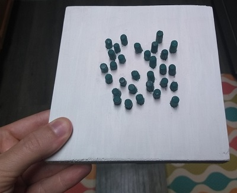
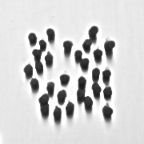
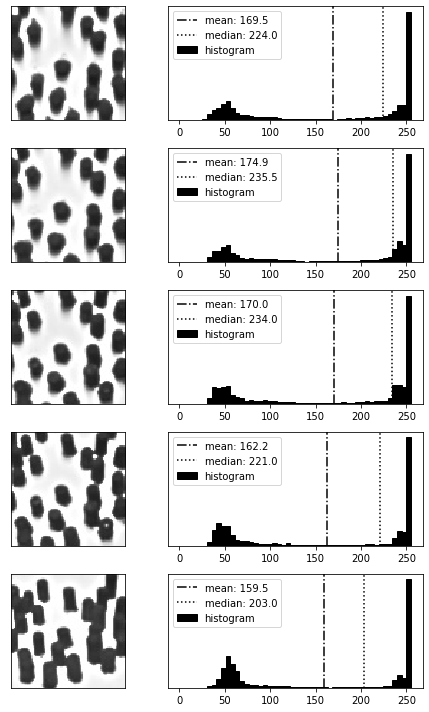
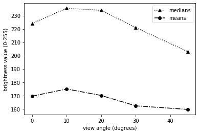

# toy-forest-model

A **forest, snow, remote sensing, python, art project for fun** and to help visualize the impacts of view angle, sun angle, and/or shadows on image brightness (whether in visible or infrared wavelengths).

* The wooden "snow" base is about 14 cm square, painted white. 

* The "trees" are made of wooden pegs glued in place and painted dark green. 

* The trees protrude about 1 cm above the base.

Black and while photos of the forest model from various angles.

---
